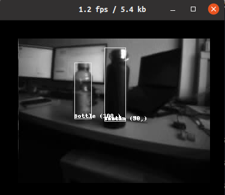

# PULP-Detector visualizer

Wi-Fi visualizer for this project: https://github.com/pulp-platform/pulp-detector

### How to visualize predictions
1. connect to the drone's wifi: "Bitcraze AI-Deck example"
2. Run: `python viewer_custom.py`

enjoy your Wi-Fi streaming:

